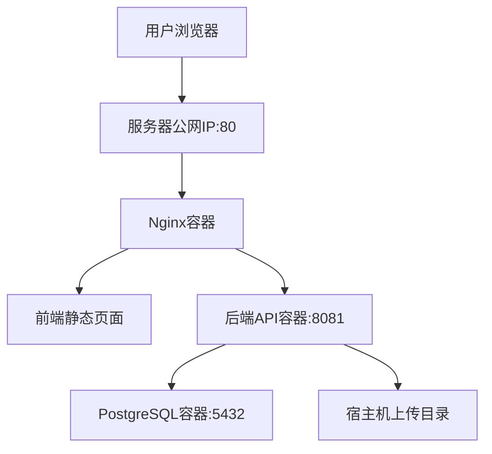

# 麒麟服务器 Docker 部署手册

本文面向第一次接触服务器部署的使用者，目标是在一台**全新安装的麒麟服务器**上，把当前项目以 **Docker** 方式部署起来，并通过**公网 IP + HTTP** 对外提供访问。

当前方案为**单机部署**：

- `nginx`：对外入口，监听 `80`
- `backend`：Spring Boot 后端，容器内监听 `8081`
- `db`：PostgreSQL 16，容器内监听 `5432`
- 上传附件目录挂载到宿主机，容器重启后数据不丢

## 一、先理解最终会部署成什么



外部访问时，用户只需要访问：

```text
http://你的服务器公网IP
```

不需要对外暴露：

- `5432`
- `8081`

## 二、服务器上需要准备什么

### 1. 基础条件

- 一台麒麟服务器
- 你有该服务器的 SSH 登录账号
- 服务器有公网 IP
- 你能从自己电脑执行 `ssh user@服务器IP`

### 2. 需要对外开放的端口

云服务器安全组 / 防火墙需要放行：

- `22/tcp`：用于 SSH 登录服务器
- `80/tcp`：用于浏览器访问系统

不要对外开放：

- `5432/tcp`
- `8081/tcp`

## 三、项目里已经准备好的部署文件

本次已经新增：

- [backend/app/Dockerfile](/Users/bwb/Documents/工作/envidence-manager/evidence-manager/backend/app/Dockerfile)
- [frontend/Dockerfile](/Users/bwb/Documents/工作/envidence-manager/evidence-manager/frontend/Dockerfile)
- [deploy/docker-compose.prod.yml](/Users/bwb/Documents/工作/envidence-manager/evidence-manager/deploy/docker-compose.prod.yml)
- [deploy/nginx/default.conf](/Users/bwb/Documents/工作/envidence-manager/evidence-manager/deploy/nginx/default.conf)
- [deploy/.env.example](/Users/bwb/Documents/工作/envidence-manager/evidence-manager/deploy/.env.example)

后端配置也已经支持环境变量覆盖，参考：

- [backend/app/src/main/resources/application.properties](/Users/bwb/Documents/工作/envidence-manager/evidence-manager/backend/app/src/main/resources/application.properties)

## 四、在服务器上安装 Docker

### 第 1 步：登录服务器

在你自己的电脑终端执行：

```bash
ssh root@你的服务器公网IP
```

如果你不是 `root`，把 `root` 换成你的服务器用户名。

### 第 2 步：确认麒麟系统版本和包管理器

登录服务器后执行：

```bash
cat /etc/os-release
which dnf || which yum || which apt
uname -m
```

你会得到：

- 系统版本信息
- 当前系统可用的包管理器
- CPU 架构（常见是 `x86_64` 或 `aarch64`）

### 第 3 步：更新系统软件源

如果系统有 `dnf`：

```bash
sudo dnf makecache
sudo dnf update -y
```

如果系统有 `yum`：

```bash
sudo yum makecache
sudo yum update -y
```

如果系统有 `apt`：

```bash
sudo apt update
sudo apt upgrade -y
```

### 第 4 步：安装常用工具

如果是 `dnf` / `yum`：

```bash
sudo dnf install -y git curl wget vim tar unzip lsof net-tools
```

如果是 `apt`：

```bash
sudo apt install -y git curl wget vim tar unzip lsof net-tools
```

### 第 5 步：安装 Docker Engine 和 Docker Compose

#### 方案 A：麒麟常见的 `dnf/yum` 方式

如果你的服务器是银河麒麟 V10 这类常见版本，通常优先用这一套。

先安装仓库管理工具：

```bash
sudo dnf install -y dnf-plugins-core || sudo yum install -y yum-utils
```

添加 Docker CE 仓库：

```bash
sudo dnf config-manager --add-repo https://mirrors.aliyun.com/docker-ce/linux/centos/docker-ce.repo || \
sudo yum-config-manager --add-repo https://mirrors.aliyun.com/docker-ce/linux/centos/docker-ce.repo
```

安装 Docker：

```bash
sudo dnf install -y docker-ce-26.1.3 docker-ce-cli-26.1.3 containerd.io docker-compose-plugin --setopt=install_weak_deps=False || \
sudo yum install -y docker-ce-26.1.3 docker-ce-cli-26.1.3 containerd.io docker-compose-plugin
```

说明：

- 对麒麟来说，`26.1.3` 是一个相对稳妥的版本
- 不建议一上来追最新版本

#### 方案 B：如果你的麒麟走 `apt`

```bash
sudo apt update
sudo apt install -y ca-certificates curl gnupg
sudo install -m 0755 -d /etc/apt/keyrings
curl -fsSL https://download.docker.com/linux/debian/gpg | sudo gpg --dearmor -o /etc/apt/keyrings/docker.gpg
sudo chmod a+r /etc/apt/keyrings/docker.gpg
echo \
  "deb [arch=$(dpkg --print-architecture) signed-by=/etc/apt/keyrings/docker.gpg] https://download.docker.com/linux/debian \
  $(. /etc/os-release && echo \"$VERSION_CODENAME\") stable" | \
  sudo tee /etc/apt/sources.list.d/docker.list > /dev/null
sudo apt update
sudo apt install -y docker-ce docker-ce-cli containerd.io docker-buildx-plugin docker-compose-plugin
```

### 第 6 步：启动 Docker 并设为开机自启

```bash
sudo systemctl enable docker
sudo systemctl start docker
sudo systemctl status docker --no-pager
```

### 第 7 步：验证 Docker 安装成功

```bash
docker --version
docker compose version
```

如果这两条命令都能正常输出版本号，说明 Docker 已安装完成。

## 五、开放服务器端口

### 1. 云服务器安全组

在你的云平台控制台里，把这两个端口放行：

- `22/tcp`
- `80/tcp`

### 2. 服务器本机防火墙

如果服务器启用了 `firewalld`，执行：

```bash
sudo systemctl enable firewalld
sudo systemctl start firewalld
sudo firewall-cmd --permanent --add-port=22/tcp
sudo firewall-cmd --permanent --add-port=80/tcp
sudo firewall-cmd --reload
sudo firewall-cmd --list-ports
```

预期看到：

```text
22/tcp 80/tcp
```

## 六、把项目代码放到服务器

推荐放到：

```text
/opt/evidence-manager/app
```

### 方式 1：如果代码已经在 Git 仓库

```bash
sudo mkdir -p /opt/evidence-manager
sudo chown -R $USER:$USER /opt/evidence-manager
cd /opt/evidence-manager
git clone <你的仓库地址> app
```

### 方式 2：如果代码只在你本机

在你自己的电脑上，把项目打包：

```bash
cd "/Users/bwb/Documents/工作/envidence-manager"
tar -czf evidence-manager.tar.gz evidence-manager
```

上传到服务器：

```bash
scp "/Users/bwb/Documents/工作/envidence-manager/evidence-manager.tar.gz" root@你的服务器公网IP:/opt/
```

然后到服务器解压：

```bash
cd /opt
tar -xzf evidence-manager.tar.gz
mv evidence-manager /opt/evidence-manager
mv /opt/evidence-manager/evidence-manager /opt/evidence-manager/app
```

如果目录结构和你的实际上传结果不一致，以最终 `ls` 看到的目录为准，目标是让项目根目录落在：

```text
/opt/evidence-manager/app
```

## 七、准备持久化目录

在服务器上执行：

```bash
sudo mkdir -p /opt/evidence-manager/data/postgres
sudo mkdir -p /opt/evidence-manager/data/uploads
sudo mkdir -p /opt/evidence-manager/logs
sudo chown -R $USER:$USER /opt/evidence-manager
```

这几个目录的作用：

- `/opt/evidence-manager/data/postgres`：数据库数据
- `/opt/evidence-manager/data/uploads`：证据附件上传目录
- `/opt/evidence-manager/logs`：你后续自己放部署日志或备份脚本日志

## 八、准备生产环境变量文件

进入项目目录：

```bash
cd /opt/evidence-manager/app
```

复制模板：

```bash
cp deploy/.env.example deploy/.env
```

编辑：

```bash
vim deploy/.env
```

最少需要改这些值：

```env
TZ=Asia/Shanghai
PUBLIC_HTTP_PORT=80

POSTGRES_DB=evidence
POSTGRES_USER=evidence
POSTGRES_PASSWORD=请改成数据库强密码

HOST_POSTGRES_DATA=/opt/evidence-manager/data/postgres
HOST_UPLOADS_DATA=/opt/evidence-manager/data/uploads

SESSION_COOKIE_SECURE=false
APP_LOG_LEVEL=INFO
MYBATIS_LOG_LEVEL=WARN
JAVA_OPTS=-Xms256m -Xmx768m

BOOTSTRAP_ADMIN_ENABLED=true
BOOTSTRAP_ADMIN_USERNAME=admin
BOOTSTRAP_ADMIN_PASSWORD=请改成管理员强密码
BOOTSTRAP_ADMIN_REAL_NAME=系统管理员
```

### 这些值是什么意思

- `POSTGRES_PASSWORD`：数据库管理员密码，必须改
- `BOOTSTRAP_ADMIN_PASSWORD`：系统首个管理员密码，必须改
- `BOOTSTRAP_ADMIN_ENABLED=true`：第一次部署时开着，用于自动创建首个管理员
- `PUBLIC_HTTP_PORT=80`：外部访问端口

## 九、启动服务

### 第 1 步：构建并启动

在项目根目录执行：

```bash
docker compose --env-file deploy/.env -f deploy/docker-compose.prod.yml up -d --build
```

第一次构建会比较慢，因为需要：

- 拉取 `postgres:16`
- 拉取 `node:20-alpine`
- 拉取 `nginx:1.27-alpine`
- 拉取 `maven:3.9.9-eclipse-temurin-17`
- 拉取 `eclipse-temurin:17-jre`
- 构建前后端镜像

### 第 2 步：查看容器状态

```bash
docker compose --env-file deploy/.env -f deploy/docker-compose.prod.yml ps
```

预期应该看到三个服务：

- `db`
- `backend`
- `nginx`

### 第 3 步：查看日志

看全部日志：

```bash
docker compose --env-file deploy/.env -f deploy/docker-compose.prod.yml logs -f
```

只看后端日志：

```bash
docker compose --env-file deploy/.env -f deploy/docker-compose.prod.yml logs -f backend
```

只看 Nginx：

```bash
docker compose --env-file deploy/.env -f deploy/docker-compose.prod.yml logs -f nginx
```

## 十、第一次启动后的验证

### 1. 先在服务器本机验证

```bash
curl http://127.0.0.1
```

如果返回一大段 HTML，说明 Nginx 正常。

再看端口监听：

```bash
ss -tuln | grep :80
```

### 2. 用浏览器访问公网 IP

在你自己的电脑浏览器打开：

```text
http://你的服务器公网IP
```

正常情况下应该能看到登录页。

### 3. 登录系统

使用你在 `deploy/.env` 里设置的：

- 用户名：`admin`
- 密码：`BOOTSTRAP_ADMIN_PASSWORD` 对应的值

### 4. 验证核心功能

建议至少验证：

- 登录成功
- 新建项目
- 创建用户
- 上传一张图片证据
- 下载证据
- 重启容器后数据仍然存在

## 十一、首次部署成功后要做的事

### 关闭首个管理员引导

首次启动成功并确认 `admin` 可登录后，把 `deploy/.env` 里的：

```env
BOOTSTRAP_ADMIN_ENABLED=true
```

改成：

```env
BOOTSTRAP_ADMIN_ENABLED=false
```

然后只重建后端：

```bash
docker compose --env-file deploy/.env -f deploy/docker-compose.prod.yml up -d backend
```

这样就不会在后续每次启动时继续尝试首管引导。

## 十二、常用运维命令

### 1. 查看容器

```bash
docker compose --env-file deploy/.env -f deploy/docker-compose.prod.yml ps
```

### 2. 停止服务

```bash
docker compose --env-file deploy/.env -f deploy/docker-compose.prod.yml down
```

### 3. 启动服务

```bash
docker compose --env-file deploy/.env -f deploy/docker-compose.prod.yml up -d
```

### 4. 更新代码后重新部署

```bash
cd /opt/evidence-manager/app
git pull
docker compose --env-file deploy/.env -f deploy/docker-compose.prod.yml up -d --build
```

### 5. 查看单个容器日志

```bash
docker logs -f evidence-backend
docker logs -f evidence-nginx
docker logs -f evidence-db
```

### 6. 进入数据库容器

```bash
docker exec -it evidence-db bash
```

进入后可执行：

```bash
psql -U evidence -d evidence
```

## 十三、数据库备份与恢复

### 1. 数据库备份

```bash
docker exec evidence-db pg_dump -U evidence -d evidence > /opt/evidence-manager/logs/evidence_$(date +%F_%H%M%S).sql
```

### 2. 上传目录备份

```bash
tar -czf /opt/evidence-manager/logs/uploads_$(date +%F_%H%M%S).tar.gz /opt/evidence-manager/data/uploads
```

## 十四、管理员恢复

如果你忘了 `admin` 密码，或管理员被误禁用：

```bash
cd /opt/evidence-manager/app
PGPASSWORD='你的数据库密码' \
psql -h localhost -U evidence -d evidence \
  -v ADMIN_PASSWORD='新的管理员密码' \
  -f db/scripts/admin_recover.sql
```

恢复脚本会：

- 确保 `admin` 存在
- 角色恢复为 `SYSTEM_ADMIN`
- 账号恢复为启用状态
- 重置密码为你传入的新密码

## 十五、如果访问不了，按这个顺序排查

### 1. 先看容器是否都起来了

```bash
docker compose --env-file deploy/.env -f deploy/docker-compose.prod.yml ps
```

### 2. 看后端日志

```bash
docker compose --env-file deploy/.env -f deploy/docker-compose.prod.yml logs --tail=200 backend
```

### 3. 看 Nginx 日志

```bash
docker compose --env-file deploy/.env -f deploy/docker-compose.prod.yml logs --tail=200 nginx
```

### 4. 看数据库是否就绪

```bash
docker compose --env-file deploy/.env -f deploy/docker-compose.prod.yml logs --tail=200 db
```

### 5. 看 80 端口是否真的开放

```bash
ss -tuln | grep :80
sudo firewall-cmd --list-ports
```

同时检查云服务器安全组是否放行 `80/tcp`。

## 十六、当前方案的边界

本方案适合：

- 单机部署
- 小中型访问量
- 当前先通过公网 IP + HTTP 访问

后续如果要更正式上线，建议第二阶段升级：

- 域名
- HTTPS
- `SESSION_COOKIE_SECURE=true`
- 数据库独立机器或托管服务
- 自动备份
- 镜像仓库和 CI/CD

## 十七、你真正需要记住的最短版本

第一次部署最核心的流程只有这几步：

1. 安装 Docker
2. 开放 `22` 和 `80`
3. 把项目放到 `/opt/evidence-manager/app`
4. 创建 `/opt/evidence-manager/data/postgres` 和 `/opt/evidence-manager/data/uploads`
5. `cp deploy/.env.example deploy/.env`
6. 修改 `POSTGRES_PASSWORD` 和 `BOOTSTRAP_ADMIN_PASSWORD`
7. 执行：

```bash
docker compose --env-file deploy/.env -f deploy/docker-compose.prod.yml up -d --build
```

8. 浏览器打开：

```text
http://服务器公网IP
```

9. 用 `admin` + 你配置的管理员密码登录
10. 登录成功后把 `BOOTSTRAP_ADMIN_ENABLED` 改成 `false`
